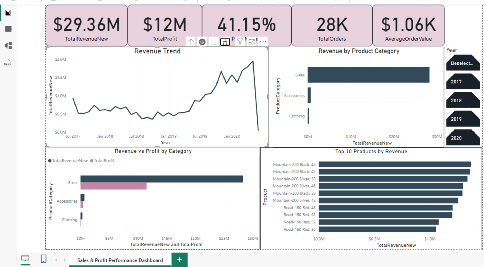

## Project Overview

This project presents an interactive Power BI dashboard designed to analyze sales performance, profitability, product performance, and revenue trends.

The dashboard was built using a sales dataset with a dedicated date table and DAX measures for key business metrics.

## Dashboard



## Key KPIs

- **Total Revenue:** $29.36M
- **Total Profit:** ~$12M
- **Profit Margin:** 41.15%
- **Total Orders:** ~28K
- **Average Order Value:** ~$1.06K

## Dashboard Analysis

The dashboard includes:

- Revenue trend over time
- Revenue by product category
- Revenue vs. profit by category
- Top 10 products by revenue
- Interactive filtering by year and product category

## DAX Measures

Several custom DAX measures were created for the analysis:

```DAX
TotalRevenueNew =
SUM(Sales[LinePrice])
```

```DAX
TotalProfit =
SUM(Sales[Profit])
```

```DAX
ProfitMargin =
DIVIDE([TotalProfit], [TotalRevenueNew])
```

```DAX
TotalOrders =
DISTINCTCOUNT(Sales[OrderNo])
```

```DAX
AverageOrderValue =
DIVIDE([TotalRevenueNew], [TotalOrders])
```

## Data Model

The project uses a dedicated `Dates` table connected to the `Sales` fact table through a one-to-many relationship.

This allows time-based filtering and analysis across the dashboard.

## Key Insights

- Total revenue reached approximately **$29.36M**.
- The business generated approximately **$12M in profit**, with an overall **41.15% profit margin**.
- Approximately **28K unique orders** were recorded.
- Average order value was approximately **$1.06K**.
- **Bikes** generated substantially more revenue than Accessories and Clothing.
- Product-level analysis highlights the highest-revenue products through a dynamic Top 10 filter.

## Skills Demonstrated

- Power BI
- DAX
- Data Modeling
- KPI Development
- Data Visualization
- Interactive Dashboards
- Filter Context
- Top N Analysis
- Business Data Analysis

## Tools

- Microsoft Power BI
- DAX
- DataCamp Power BI environment

- Microsoft Power BI
- DAX
- DataCamp Power BI environment
